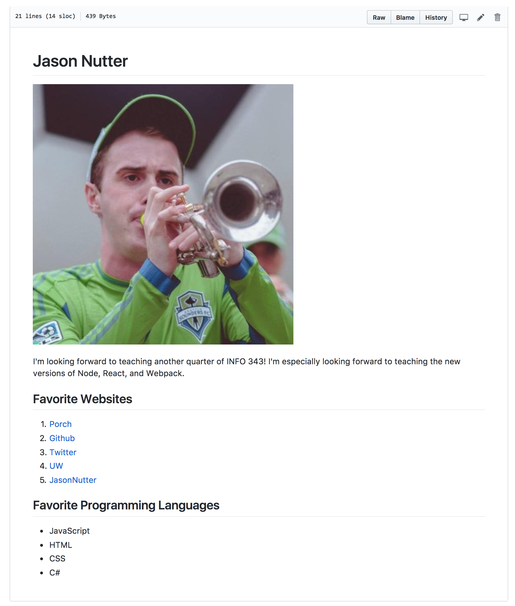

# Challenge 1 - Git & Github

For this challenge, you will demonstrate your knowledge of Git, Github, and Markdown by setting up your `challenges` repository and adding an `ABOUTME.md` file with a short biography about yourself.

## Resources

* <a href="https://canvas.uw.edu/courses/1118281/assignments/3820993" target="_blank">Reading</a>
* <a href="https://info343a-au17-slides.surge.sh/#/2" target="_blank">Lecture Slides</a>

## Instructions

### 1. Create a Github.com account

If you don't already have one, please create an account on <a href="https://github.com" target="_blank">Github.com</a>. If possible, please make your username close to your UW NetID.

### 2. Accept the Github Classroom Invite

**<a href="https://classroom.github.com/a/oLjrwE8V" target="_blank">Invite Link</a>**

Clicking the invitation link will create a new private repo in our class GitHub organization, which will contain the starter code for all of the challenges (initially will only contain starter code for this challenge). This repository will be visible only to you and the teaching team. You only need to accept this invitation once (i.e. you don't need to go to that url again for the remaining challenges).

Clone this new repo to your personal computer. For this challenge you will be working in the `challenge1` directory.

### 3. Create a branch

Create a new branch on your personal computer named `challenge1` and switch to it. All commits for this challenge should be done on this branch. You will create a pull request to merge those back into master at the end of the challenge.

### 4. Add a .gitignore File

Create a `.gitignore` file in the root directory of the repo (not in the `challenge1` folder) with the following entries:

* Files named `.DS_Store`
* Directories named `node_modules`
* Directories named `.vscode`
* Directories named `.idea`

### 5. Add an ABOUTME.md file

Add a new file in the `challenge1` folder named `ABOUTME.md`. It must be written in Markdown, and should have the following structure.

1. A top level heading with your name.
2. A photo of yourself (upload the image to the `challenge1` folder).
3. A paragraph of text detailing what you are looking forward to learning in this class.
4. A second level heading with the text "Favorite Websites".
5. A numbered list with links to your 5 favorite websites. Each link should have the name of website as the displayed text.
6. A second level heading with the text "Favorite Programming Languages".
7. An unordered/bulleted list with your favorite programming languages.

### 6. Commit your files

Commit your files to your `challenge1` branch. When you are done, push your branch to Github.

### 7. Open pull request

On Github, create new pull request from your `challenge1` branch to `master`, but **do not complete the merge yourself**. We will merge your pull request when we have completed grading your work.

### 8. Submit Your Solution

Submit a link to your GitHub pull request to complete this assignment. We will use the pull request to review your code.

## Example

