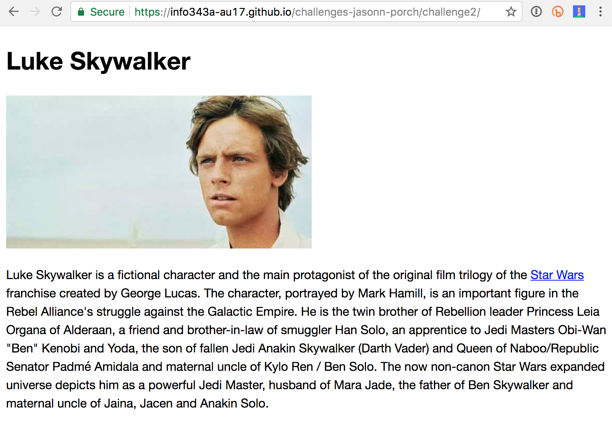

# Challenge 2 - HTML && CSS

For this challenge you will demonstrate your Git, GitHub, HTML, and CSS skills by building a profile page for your favorite fictional character and hosting it on the web. This character can be from a movie, television series, book, comic, or short story.

## Resources

* <a href="https://canvas.uw.edu/courses/1118281/assignments/3820991" target="_blank">HTML Reading and Slides</a>
* <a href="https://validator.w3.org/#validate_by_upload" target="_blank">HTML Validation Service</a>
* <a href="https://canvas.uw.edu/courses/1118281/assignments/3820994" target="_blank">CSS Reading and Slides</a>
* <a href="http://jigsaw.w3.org/css-validator/#validate_by_upload" target="_blank">CSS Validation Service</a>

## Instructions

### 1. Update your challenge repo

First, you must accept the formal invite to <a href="https://github.com/info343a-au17/" target="_blank">our Github organization</a>, so that you can update your challenges repository with the starter code for this challenge. After creating your challenges repository, you should have received an invitation. To verify, you should be able to view <a href="https://github.com/info343a-au17/challenges" target="_blank">this repo on Github</a>. If you are unable to view that repo, please contact me directly to ensure you are added.

Next, please perform the following steps in your challenges repo (on your personal machine) to update your repo and pull down the latest starter code.

1. First, verify you have no uncommitted changes: `git status`
2. Switch back to your `master` branch: `git checkout master`
3. Pull the latest code into your `master` branch: `git pull`
4. You are now ready to connect your repo to the main challenges repo. To do so, perform this command (you only need to perform this command once for each computer): `git remote add upstream https://github.com/info343a-au17/challenges.git`
5. Create a new branch for this challenge: `git checkout -b challenge2`
6. Now update your repo with the new starter code for this challenge. To do so, perform this command (you will need to perform this command once each week when a new challenge is posted): `git pull upstream master`
7. If you receive a permissions error, please check your email for an invite to the organization, and accept the invite. If you cannot find the invite, please contact the teaching team immediately.
8. If you encounter a merge conflict, you will need to resolve the merge conflict before you can start. Please contact the teaching team if you need help.
9. You can now push this new branch to Github: `git push -u origin challenge2`

You are now ready to start working on the challenge. Just like the first challenge, all work should be committed to a feature branch, and then you will open a pull request from that branch into master. You will also merge your code from your feature branch into the `gh-pages` branch to host your work on Github Pages.

### 2. Create a Branch

Create a new branch on your personal computer named `challenge2` and switch to it. All commits for this challenge should be done on this branch. You will create a pull request to merge those back into master at the end of the challenge.

### 3. Add an index.html file

Create a new file named `index.html` in the `challenge2` directory, and add the following content:

* The basic HTML5 document structure.
* An attribute that tells programs reading this page (including indexers and assistive technologies) that the content in this page is in English.
* An element that tells programs reading this page that the text is encoded in the `UTF-8` encoding scheme.
* An element in the head section that sets this page's title to the name of your chosen character.
* The character's name, encoded as a top-level heading in the body section.
* A description of the character encoded as a normal paragraph. Within that description, mention what book/story/comic/series/film the character is from, and make the title of that work be a hyperlink to another existing web page that provides more information about the work.
* A picture of the character, with appropriate alternate text. This image should be saved into the `challenge2/img` folder. If the filename of your image is long, please shorten it to just a few words. Remove any spaces in the filename, or replace them with dashes or underscores (e.g. `lukeskywalker.jpg`, `luke-skywalker.jpg`, or `luke_skywalker.jpg`).

### 4. Add a style.css file

In the `css` folder inside the `challenge2` directory, create a file named `style.css`.

Add an element to your HTML page that tells the browser to load style rules from your `style.css` file that lives in the css subdirectory.

In the `style.css` file, add rules to accomplish the following:

* Set the default font to be `'Helvetica Neue'`, followed by `Helvetica`, `Arial`, and finally `sans-serif`. You may also use a web font, such as one from <a href="https://fonts.google.com/" target="_blank">Google Fonts</a>. Please keep the other fonts (mentioned above) as fallbacks.
* Set the default font size to be `16` pixels in height.
* Set the line height of all paragraphs to `1.5` the normal line height.
* <a href="https://developer.mozilla.org/en-US/docs/Web/CSS/max-width" target="_blank">Constain the width of your image</a> to be no more than `400` pixels. That is, your image can be smaller than `400` pixels, but it should never appear any larger than `400` pixels on screen.

### 5. Validate your code

Use the <a href="https://validator.w3.org/#validate_by_upload" target="_blank">HTML Validation Service</a> to validate your HTML and fix any errors or warnings that are reported. The report should contain specific instructions and/or links that will help you fix the problems.

Also use the [CSS Validation Service](http://jigsaw.w3.org/css-validator/#validate_by_upload) to validate your CSS and fix any errors or warnings that are reported.

**We will run your HTML and CSS through these validators and you will lose points if any errors/warning are reported!**

### 6. Commit your files

Whenever you complete some work that you want to commit, add all your changed files to your local git repo, commit the changes, and push your `challenge2` branch to GitHub. Include a sensible commit message so that other developers (including us) can understand what changed in this commit.

### 7. Publish to GitHub Pages

To publish your page to the web, create a new branch in your repo named `gh-pages`, and merge all commits you've made to the `challenge2` branch into the `gh-pages` branch. Then push this new `gh-pages` branch to GitHub. After the push is complete, you should be able to see your page at the following URL, replacing `your-github-username` with your GitHub user name.

`https://info343a-au17.github.io/challenges-your-github-username/challenge2/`

You can do this directly on your personal computer before pushing to Github, i.e. you do not need to use a pull request to merge your code in the `gh-pages` branch.

### 8. Open pull request

On GitHub, create a new pull request to merge your commits from the `challenge2` branch to the `master` branch, but do not complete the merge yourself. Your grader will complete the merge after grading and adding in-line comments to your pull-request code.

In the pull request description, please briefly describe your page and provide a link to your page publish on Github Pages.

### 9. Submit Your Solution

Submit a link to your GitHub pull request to complete this assignment. We will use the pull request to review your code, and we will also check the functionality your published site, so make sure your GitHub pages site is working correctly.

## Example

